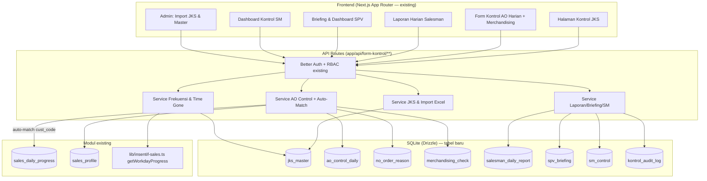

<!--
Tujuan: PRD modul Form Kontrol SUPER (Sistem Kontrol SUPER / infografis 1) — add-on di atas modul insentif-sales.
Caller: Tim pengembang AccAPI (Next.js + FastAPI), produk owner, SM/SPV sebagai pengguna bisnis.
Dependensi: modul insentif-sales (salesProfile, salesDailyProgress, salesTargets), Better Auth + RBAC, Drizzle SQLite.
Main Sections: Overview, Requirements, Core Features (8 komponen), User Flow, Architecture, Database Schema, Strategi Query/Index, Tech Stack, Rollout.
Side Effects: dokumen perencanaan (tidak ada perubahan kode). Implementasi nanti: tulis DB (tabel jks_* baru), file I/O (foto merchandising), tidak ada HTTP eksternal.
-->

# PRD — Form Kontrol SUPER (Sistem Kontrol SUPER)

## 1. Overview

Modul **Form Kontrol SUPER** adalah pengembangan (*add-on*) di atas platform AccAPI yang sudah ada, melengkapi modul **Insentif Sales** (`app/(dashboard)/insentif-sales`) yang saat ini menampilkan pencapaian dan insentif. Jika modul insentif menjawab *"berapa capaian dan insentifnya"*, modul Form Kontrol menjawab *"mengapa toko tidak order dan apa tindak lanjutnya"* — mengubah filosofi **"AO 240 bukan untuk ditawar, AO 240 untuk dicapai"** menjadi alat kontrol harian yang terukur.

Inti modul adalah **JKS (Jadwal Kunjungan Salesman)** sebagai *single source of truth* daftar toko per salesman, lalu delapan komponen kontrol yang berjenjang dari salesman ke SPV ke SM. Prinsip utamanya: **setiap toko dalam JKS yang tidak order wajib memiliki alasan yang jelas dan terdokumentasi**, sehingga "tidak ada toko tanpa status, tidak ada toko tanpa alasan".

Modul ini terintegrasi dua arah dengan modul insentif-sales: status order toko (AO) **dideteksi otomatis** dari data penjualan harian (`sales_daily_progress`) sehingga salesman tidak perlu input ganda — sistem hanya meminta salesman mengisi *alasan* untuk toko JKS yang belum tercatat order. Dengan begitu, pencapaian AO di modul insentif dan kontrol toko tidak-order di modul ini berasal dari sumber data yang sama dan selalu konsisten.

Cakupan PRD ini mencakup seluruh **8 komponen kontrol** pada infografis: (1) Kontrol JKS, (2) Form Kontrol AO Wajib, (3) Kontrol Toko Tidak Order, (4) Merchandising Wajib, (5) Laporan Wajib Salesman, (6) Briefing Wajib SPV, (7) Kontrol Wajib SM, dan (8) Kontrol Frekuensi Kunjungan.

## 2. Requirements

- **Manajemen Peran & Akses (RBAC):** Memperluas Better Auth + `lib/rbac.ts` yang sudah ada dengan modul baru `form-kontrol` dan empat peran fungsional:
  - **Admin Sales:** Mengunggah & mengelola master JKS (impor dari Excel sesuai format file `JKS_Super.xlsx`), mengelola master alasan tidak-order, dan konfigurasi frekuensi kunjungan. Tidak dapat memodifikasi laporan harian salesman.
  - **Salesman:** Melihat JKS pribadi, mengisi Form Kontrol AO harian (alasan toko tidak order, status visit), mengisi checklist Merchandising, dan submit Laporan Harian.
  - **SPV:** Melakukan Briefing pagi/sore, memvalidasi laporan salesman, melihat dashboard tim, dan menentukan toko prioritas. Mengendalikan lapangan, bukan menerima laporan pasif.
  - **SM:** Mengontrol bahwa setiap SPV menjalankan fungsinya — memeriksa JKS, memonitor laporan & foto kunjungan, mencatat penyimpangan/keterlambatan, dan follow-up.
- **JKS sebagai SSoT:** Master JKS wajib memuat seluruh toko tanggung jawab salesman, disusun per rute (Area/Rayon), dengan jadwal hari kunjungan dan pola minggu (Ganjil/Genap/Semua). Struktur kolom mengikuti file existing: `Kode Sales`, `KODE_CUST`, `CUSTOMER`, `MARKET`, `ALAMAT`, `KOTA`, `Hari kunjngn`, `Minggu Ganjil/Genap`, `JKS Untuk (Area)`, `Rayon`, `DIVISI` (= Principle).
- **Integrasi Auto Order-Status:** Status order setiap toko diturunkan otomatis dengan mencocokkan `jks_master.cust_code` terhadap transaksi penjualan level-customer per tanggal & periode. Toko yang punya transaksi → `ordered`; toko JKS tanpa transaksi → `not_order` (wajib alasan). **Prasyarat penting:** tabel `sales_daily_progress` yang ada saat ini bersifat **agregat** (hanya menyimpan jumlah `achieved_ao`, `achieved_value_dpp`, dan `invoice_number` per sales/principle/tanggal — **tanpa `cust_code`**), sehingga belum cukup untuk pencocokan per-toko. Maka modul ini menambahkan feed penjualan level-customer (lihat tabel `sales_outlet_txn` di §6) yang diisi dari data penjualan mentah (kolom `KODE_CUST` pada file Data Penjualan). Jika feed ini belum tersedia, modul tetap berfungsi dengan input AO **manual** oleh salesman, dan auto-match diaktifkan saat feed siap (lihat Rollout §9).
- **Konsistensi Multi-Principle:** Satu toko bisa muncul di JKS untuk lebih dari satu principle (GODREJ, MONTISS, MUSTIKA RATU, SOFTEX). Kontrol AO dihitung **per principle** agar selaras dengan perhitungan AO per principle di modul insentif (Infografis 2 & 3: target 240 AO/principle/sales).
- **Logika Time Gone:** Memakai ulang `getWorkdayProgress()` dari `lib/insentif-sales.ts` untuk menilai kewajaran progres AO harian terhadap hari kerja yang berlalu, dan untuk *color tagging*.
- **Frekuensi Kunjungan Adaptif:** Sistem mendukung pola order berbeda (1×, 2×, 4× per bulan) per toko, diturunkan dari pola minggu JKS, dan dipakai untuk menghitung kapasitas kunjungan & menghindari over/under-visit.
- **Audit Trail:** Setiap aksi kontrol (submit laporan, briefing, kontrol SM, perubahan JKS) tercatat pada log audit, mengikuti pola `writeOffAudit`/`writeClaimAudit` yang sudah ada.
- **Mobile-First:** Form salesman (AO harian, merchandising, laporan) dioptimalkan untuk perangkat mobile/PWA (modul existing sudah punya `PWAInstallPrompt`).

## 3. Core Features

Delapan komponen kontrol dipetakan langsung dari infografis ke fitur produk:

### 3.1 Kontrol JKS (Komponen 1)
Halaman master JKS per salesman: tabel toko lengkap (Kode/Nama Toko, Market, Alamat, Kota, Hari Kunjungan, Pola Minggu, Area, Rayon, Principle). Fitur:
- **Impor Excel** mengikuti format `JKS_Super.xlsx` (Admin Sales), dengan validasi kolom dan deteksi duplikat (`cust_code` + `principle` + `sales_code`).
- **Validasi kelengkapan rute:** indikator toko yang belum punya hari kunjungan / pola minggu (pada data sampel ada 44 baris kosong) — wajib dilengkapi.
- **Status pencarian toko:** seluruh toko dalam JKS wajib "dicari sampai ditemukan"; toko yang tidak ditemukan ditandai agar tidak hilang dari kontrol ("toko yang tidak ditemukan tidak akan pernah menjadi AO").

### 3.2 Form Kontrol AO Wajib (Komponen 2)
Form harian per salesman per principle. Sistem menampilkan **rute hari ini** (toko yang terjadwal pada hari & pola minggu berjalan), lalu untuk tiap toko menampilkan status auto-deteksi:
- **Sudah order / aktif** (otomatis dari `sales_daily_progress`).
- **Belum order** (perlu alasan).
- **Prioritas** (ditandai SPV/salesman).

AO dikontrol **harian**, bukan menunggu akhir bulan. Indikator Time Gone vs progres AO ditampilkan di header.

### 3.3 Kontrol Toko Tidak Order (Komponen 3)
Untuk setiap toko berstatus `not_order`, salesman **wajib** memilih kode alasan dari master (mengikuti 14 contoh infografis): stok masih cukup, SKU belum lengkap, produk belum terpajang, produk sulit ditemukan konsumen, PIC belum mengenal produk, PIC belum percaya, toko masih punya tagihan OD, salesmanship belum kuat, negosiasi belum berhasil, kunjungan kurang rutin, toko kurang diperhatikan, dan lainnya. Aturan: **tidak boleh ada toko tanpa alasan** (validasi submit). Alasan dikelompokkan per kategori (stok / produk / relasi / tagihan / proses) untuk analitik penyebab.

### 3.4 Merchandising Wajib (Komponen 4)
Checklist merchandising per kunjungan: produk terlihat jelas, display rapi, produk dibersihkan, ditata ulang, posisi mudah ditemukan konsumen, seluruh SKU terpajang. Mendukung **unggah foto** (file I/O ke direktori runtime, pola sama dengan dokumen klaim/OPC). Filosofi: "barang masuk menciptakan order hari ini; barang keluar menciptakan repeat order bulan depan".

### 3.5 Laporan Wajib Salesman (Komponen 5)
Ringkasan sore yang disubmit salesman ke SPV: jumlah toko dalam JKS, jumlah order, jumlah aktif, jumlah tidak order, rekap alasan tidak-order, alasan tidak dikunjungi, dan **tindak lanjut** yang akan dilakukan. Sebagian besar angka **terisi otomatis** dari Form AO; salesman hanya melengkapi narasi tindak lanjut. Validasi: tidak boleh ada toko tanpa status/alasan.

### 3.6 Briefing Wajib SPV (Komponen 6)
Log briefing dua sesi:
- **Pagi:** memastikan JKS layak dijalankan, salesman paham area, seluruh toko valid.
- **Sore:** membahas toko tidak order, toko tidak dikunjungi, penyebab, dan solusi.

Setiap sesi menyimpan agenda terchecklist, toko yang dibahas, penyebab, dan solusi. Menegaskan peran: "tugas SPV bukan menerima laporan, tetapi mengendalikan lapangan".

### 3.7 Kontrol Wajib SM (Komponen 7)
Dashboard & log kontrol SM atas seluruh SPV: cek JKS tiap hari, monitor laporan foto kunjungan, catat SPV yang produktif/tidak, coaching, identifikasi penyebab toko tidak order, catat penyimpangan & keterlambatan beserta tindak lanjut, dan Time Gone per SPV. Menegaskan: "tugas SM bukan mengontrol salesman langsung, tetapi memastikan SPV benar-benar mengontrol salesmannya".

### 3.8 Kontrol Frekuensi Kunjungan (Komponen 8)
Konfigurasi & simulasi frekuensi: tiap toko punya frekuensi (1×/2×/4× per bulan) diturunkan dari pola minggu JKS. Simulasi kapasitas mengikuti infografis (24 hari kerja × 20 kunjungan/hari = 480 kunjungan → 480÷1 = 480 toko, 480÷2 = 240 toko). Sistem memberi peringatan **over-visit** (toko cukup 1×/bulan justru dikunjungi 2×) agar coverage optimal dan waktu tidak terbuang.

## 4. User Flow

**Salesman (harian):**
1. Login → buka **Form Kontrol AO** (rute hari ini otomatis muncul per principle).
2. Sistem menandai toko yang sudah order (auto dari penjualan). Salesman mengisi **alasan** untuk toko belum order + status visit.
3. Mengisi **checklist Merchandising** + unggah foto pada toko yang dikunjungi.
4. Sore hari, submit **Laporan Harian** (angka auto-terisi, lengkapi tindak lanjut).

**SPV (harian):**
1. **Briefing pagi** — validasi JKS & kesiapan tim.
2. Pantau dashboard tim sepanjang hari (status AO, toko tidak order, color tagging Time Gone).
3. Tandai toko **prioritas**.
4. **Briefing sore** — bahas toko tidak order/tidak dikunjungi, catat penyebab & solusi, acknowledge laporan salesman.

**SM (harian/mingguan):**
1. Buka **Dashboard Kontrol SM** — status kontrol tiap SPV, kelengkapan JKS, foto kunjungan.
2. Coaching SPV yang tidak produktif; catat penyimpangan + follow-up.

**Admin Sales (periodik):**
1. Impor/perbarui **master JKS** dari Excel.
2. Kelola master **alasan tidak-order** & **frekuensi kunjungan**.

## 5. Architecture

Pola arsitektur mengikuti konvensi existing: route group `(dashboard)/form-kontrol`, API di `app/api/form-kontrol/`, business logic di `lib/form-kontrol/` (modular per tanggung jawab: `access.ts`, `jks.ts`, `ao-control.ts`, `auto-match.ts`, `reports.ts`, `frequency.ts`, `import.ts`, `constants.ts`, `types.ts`, `audit.ts`).

## 6. Database Schema

Penambahan tabel baru ke `db/schema.ts`. Tipe & gaya mengikuti tabel existing (`text` id, `integer timestamp`, index eksplisit). Relasi memakai `sales_code`/`cust_code` sebagai kunci bisnis (selaras dengan `sales_profile`, `sales_daily_progress` yang sudah memakai `sales_code`).

- **`jks_master`** — master rute kunjungan (1 baris = 1 toko × 1 principle × 1 sales):
  `id`, `sales_code`, `sales_name`, `cust_code`, `cust_name`, `market`, `alamat`, `kota`, `hari_kunjungan`, `minggu_pattern` (`ganjil|genap|all`), `area`, `rayon`, `principle`, `channel` (TT/MT, default TT), `visit_frequency` (1|2|4, derivasi `minggu_pattern`), `is_active` (bool), `created_at`, `updated_at`.
  *Index:* `(sales_code, principle)`, `(cust_code)`, `(principle, hari_kunjungan)`.

- **`sales_outlet_txn`** — feed penjualan level-customer (jembatan auto-match; diisi dari data penjualan mentah ber-`KODE_CUST`):
  `id`, `sales_code`, `cust_code`, `principle`, `date`, `period_month`, `period_year`, `invoice_number`, `value_dpp` (real), `created_at`.
  *Index:* `(cust_code, date)`, `(sales_code, period_month, period_year)`.
  *Catatan:* tabel ini melengkapi (bukan menggantikan) `sales_daily_progress` yang tetap dipakai modul insentif untuk agregat AO/Value. Idealnya keduanya diturunkan dari sumber unggahan yang sama agar konsisten.

- **`no_order_reason`** — master alasan (seed dari 14 contoh infografis):
  `id`, `reason_code`, `label`, `category` (`stok|produk|relasi|tagihan|proses|lainnya`), `sort_order`, `is_active`.

- **`ao_control_daily`** — kontrol AO + tidak-order per toko/hari:
  `id`, `sales_code`, `cust_code`, `principle`, `date` (YYYY-MM-DD), `period_month`, `period_year`, `status` (`ordered|active|not_order|not_visited|priority`), `order_value_dpp` (real), `invoice_number`, `is_visited` (bool), `no_order_reason_code`, `no_order_note`, `auto_matched` (bool — true jika status diturunkan dari penjualan), `source` (`auto|manual`), `created_by`, `created_at`.
  *Index:* `(sales_code, date)`, `(cust_code, period_month, period_year)`, `(status)`, unik `(sales_code, cust_code, principle, date)`.

- **`merchandising_check`** — checklist + foto per kunjungan:
  `id`, `sales_code`, `cust_code`, `principle`, `date`, `produk_jelas` (bool), `display_rapi` (bool), `dibersihkan` (bool), `ditata_ulang` (bool), `posisi_mudah` (bool), `semua_sku` (bool), `photo_url`, `note`, `created_at`.

- **`salesman_daily_report`** — laporan sore salesman:
  `id`, `sales_code`, `date`, `period_month`, `period_year`, `total_toko_jks`, `total_order`, `total_active`, `total_not_order`, `total_not_visited`, `reason_summary` (JSON), `tindak_lanjut` (text), `submitted_at`, `spv_ack` (bool), `spv_ack_by`, `spv_ack_at`.
  *Index:* `(sales_code, period_month, period_year)`, `(date)`.

- **`spv_briefing`** — log briefing pagi/sore:
  `id`, `spv_name`, `date`, `session` (`pagi|sore`), `agenda` (JSON checklist), `toko_dibahas` (JSON), `penyebab` (text), `solusi` (text), `created_by`, `created_at`.

- **`sm_control`** — log kontrol SM atas SPV:
  `id`, `sm_name`, `date`, `spv_checked` (JSON daftar SPV), `jks_checked` (bool), `foto_checked` (bool), `coaching_note` (text), `deviations` (JSON keterlambatan/penyimpangan), `follow_up` (text), `created_by`, `created_at`.

- **`kontrol_audit_log`** — audit trail:
  `id`, `entity` (`jks|ao|report|briefing|sm`), `entity_id`, `action`, `actor_id`, `actor_name`, `payload` (JSON), `created_at`.

**Catatan integrasi:** modul ini **membaca** `sales_outlet_txn`, `sales_daily_progress`, dan `sales_profile` (tidak mengubahnya). `ao_control_daily.status` di-*backfill* dari auto-match terhadap `sales_outlet_txn` (level-customer); `salesman_daily_report` agregatnya dihitung dari `ao_control_daily`. `visit_frequency` & Time Gone memakai ulang helper `lib/insentif-sales.ts`. Bila feed customer-level belum ada, status AO diisi manual dan auto-match menyusul.

## 7. Strategi Query & Index (DBA-Grade)

Rancangan dioptimalkan untuk *minimum I/O* dan menghindari N+1, karena `jks_master` berskala besar (~6.169 baris pada sampel, akan tumbuh):

- **Auto-match order status (proses terberat):** dijalankan sebagai **single set-based query** per (sales × tanggal × periode), bukan loop per toko. Strategi: `LEFT JOIN` agregat `sales_outlet_txn` (di-*group by* `cust_code`) ke daftar `jks_master` rute hari itu, lalu `upsert` batch ke `ao_control_daily` via `INSERT ... ON CONFLICT (sales_code, cust_code, principle, date) DO UPDATE`. Ini menghindari N+1 (tidak query per toko) dan memanfaatkan index `(cust_code, date)`. (Catatan: join **tidak** ke `sales_daily_progress` karena agregat itu tidak menyimpan `cust_code`.)
- **Rute hari ini:** filter `jks_master` dengan predikat selektif `sales_code = ? AND hari_kunjungan = ? AND minggu_pattern IN (?, 'all') AND is_active = 1`, ditopang index `(sales_code, principle)` + index harian. Kardinalitas filter tinggi (1 sales × 1 hari) → hasil kecil, cost rendah.
- **Dashboard agregat (SPV/SM):** gunakan agregasi `GROUP BY` ber-periode pada `ao_control_daily` (memanfaatkan `(cust_code, period_month, period_year)` & `status`), hindari menarik baris mentah ke aplikasi lalu menghitung di memori.
- **Konsistensi:** auto-match & upsert laporan dijalankan dalam satu transaksi per salesman/hari agar idempoten (re-run aman, tidak dobel) — selaras pola idempotency existing.
- **Trade-off:** denormalisasi ringan (`sales_name`, `principle` disimpan di `ao_control_daily`) dipilih untuk menghindari join ke `sales_profile` pada query dashboard panas; risiko stale-name kecil dan dapat disinkronkan saat impor JKS. Penulisan berlapis dihindari dengan batch upsert tunggal.

## 8. Tech Stack

Mengikuti standar sistem existing tanpa menambah dependensi baru:
- **Frontend:** Next.js 16 (App Router), React 19, TypeScript; Tailwind CSS 4 + komponen `components/ui` & `DataTable` (TanStack Table) existing.
- **Backend/API:** Next.js API Routes + Server Actions; business logic terisolasi di `lib/form-kontrol/`.
- **Database:** SQLite via libSQL + Drizzle ORM; migrasi via `drizzle-kit` + skrip `scripts/` (pola `migrate-*.mjs`).
- **Auth & RBAC:** Better Auth + `lib/rbac.ts` (tambah modul `form-kontrol` + 4 peran).
- **Excel Import:** library `xlsx` yang sudah dipakai sistem (impor master JKS).
- **File (foto merchandising):** disimpan ke `runtime/form-kontrol/` (pola sama dengan `runtime/off-program-control/`).
- **PWA/Mobile:** memanfaatkan service worker & `PWAInstallPrompt` existing.

## 9. Rollout Bertahap

- **Fase 1 — Pondasi:** Master `jks_master` + impor Excel, `no_order_reason`, RBAC modul `form-kontrol`.
- **Fase 2 — Kontrol Harian:** Form AO (input manual dulu) + Kontrol Toko Tidak Order + Merchandising. Auto-match diaktifkan begitu feed `sales_outlet_txn` (penjualan level-customer ber-`KODE_CUST`) tersedia — ini *prasyarat teknis* Fase 2 karena `sales_daily_progress` existing bersifat agregat tanpa `cust_code`.
- **Fase 3 — Pelaporan & Pengawasan:** Laporan Salesman, Briefing SPV, Kontrol SM, audit log.
- **Fase 4 — Frekuensi & Analitik:** Kontrol Frekuensi Kunjungan, simulasi kapasitas, dashboard penyebab (analitik kategori alasan), peringatan over/under-visit.

> Setelah implementasi Fase 1 mulai masuk kode, perbarui `SYSTEM_MAP.md` (tambah bagian "Form Kontrol SUPER" pada Module Map, Core Logic Flow, dan Clean Tree) sesuai aturan Synchronized Map Update.
