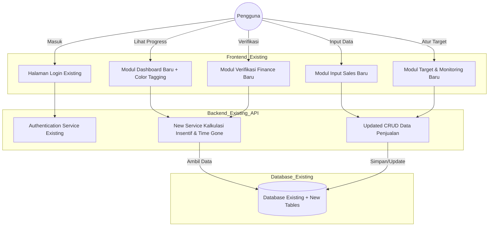

# PRD — Project Requirements Document

## 1. Overview
Proyek ini merupakan modul pengembangan (*add-on*) dari platform yang sudah ada untuk mengoptimalkan *tracking* performa dan pencapaian *sales* (penjualan) guna menggantikan proses manual berbasis Excel. Modul ini diintegrasikan ke dalam ekosistem sistem yang berjalan untuk mengotomatisasi perhitungan insentif yang bersifat strata (berjenjang) berdasarkan empat indikator utama: **Value** (Nilai Penjualan), **Effective Call (EC)**, **Aktif Outlet (AO)**, dan **Item Super per Toko (IA/AO)**. Sistem akan memisahkan perhitungan ini berdasarkan *Principle* (Prinsipal/Merk) dan Cabang pengampu.

Tujuan utama pengembangan ini adalah memperkaya fungsionalitas sistem yang ada agar tenaga sales dapat memantau kemajuan (*progress*) harian mereka, taksiran insentif, serta status performa dibandingkan dengan waktu yang telah berjalan (*Time Gone*) secara seketika (*real-time*). Untuk mewujudkan pemantauan yang efektif, modul ini akan menambahkan dashboard dengan tiga bagian vertikal yang berurutan mengikuti standar UI/UX aplikasi *existing*. Pertama, **Grafik Blok Performa** untuk ringkasan visual. Kedua, **Tabel Pencapaian** horizontal dengan *dynamic color tagging* terhadap *Time Gone* dan kolom **Total Achievement**. Ketiga, **Tabel Insentif** terpisah di bawah untuk merinci nominal rupiah. Alur pengguna dirancang selaras dengan sistem saat ini namun dengan penajaman urutan visual dari Grafik Blok ke Tabel Pencapaian hingga ke Tabel Insentif.

## 2. Requirements
- **Manajemen Peran & Akses (Role-Based Access Control):** Menggunakan sistem autentikasi yang sudah ada dengan perluasan hak akses sebagai berikut:
  - **Admin Sales:** Bertugas mengunggah dan mengelola data laporan penjualan harian/mingguan ke dalam modul. Memiliki akses penuh terhadap modul input data penjualan dan sinkronisasi laporan.
  - **SPV / Sales Manager:** Bertugas menetapkan target bulanan, mengatur skema insentif strata, serta memantau performa tim. Memiliki akses untuk melihat total insentif yang diterima oleh masing-masing salesman.
  - **Finance:** Bertugas memverifikasi nominal insentif, memperbarui status pembayaran (lunas/belum), serta mengunggah bukti pembayaran. Finance tidak dapat mengubah data penjualan, target, maupun skema insentif.
- **Struktur Wilayah & Merek:** Sistem harus mengelompokkan data berdasarkan Cabang (diambil dari kolom **JENISPRODUK**) dan Prinsipal (diambil dari kolom **PRINCIPAL**).
- **Parameter KPI:** Sistem harus mengakomodasi jenis target bulanan:
  - *Value* (Rp)
  - *Effective Call* (Jumlah kunjungan berbuah transaksi)
  - *Aktif Outlet* (Jumlah toko aktif)
  - *Item Aktif (IA)*: Digunakan sebagai komponen pembagi.
  - *Item Super per Toko*: Dihitung dari total Item Aktif (IA) dibagi total Aktif Outlet (AO) per sales per periode.
- **Skema Insentif Berjenjang (Strata):** Menghitung insentif secara otomatis berdasarkan persentase capaian target, dipisah per Prinsipal dan Cabang.
- **Pembaruan Harian:** Sistem memfasilitasi pencatatan data penjualan harian untuk menghasilkan laporan pencapaian *up-to-date*.
- **Konsistensi Data & Single Source of Truth (SSoT):** Seluruh data yang ditampilkan di semua tampilan pengguna (Admin Sales, SPV/Sales Manager, Finance, dan Tenaga Sales) **harus identik dan berasal dari sumber data yang sama**.
- **Logika Time Gone & Color Tagging:** Sistem harus menghitung persentase hari kerja yang telah berlalu terhadap total hari kerja dalam sebulan sebagai acuan penilaian performa harian.
- **Struktur Visual Dashboard:** Modul tambahan ini wajib menyajikan tiga bagian vertikal berurutan pada dashboard (Sales, SPV, SM):
  1. **Grafik Blok Performa** di bagian paling atas.
  2. **Tabel Pencapaian** di tengah dengan *Dynamic Color Tagging* dan kolom **Total Achievement** di ujung kanan.
  3. **Tabel Insentif** terpisah di bagian bawah merinci nominal rupiah per KPI.
- **Alur Navigasi Pengguna:** Navigasi mengikuti standar sistem yang ada namun mewajibkan urutan visual: Grafik Blok ➔ Tabel Pencapaian ➔ Tabel Insentif secara runtut tanpa menggabungkan data pencapaian dan insentif dalam satu baris.

## 3. Core Features
- **Dashboard Progress Harian (Sales View):** Integrasi tampilan pada menu sales dengan identitas visual yang sama. Di bagian atas disediakan **Filter Principle & Cabang** serta **Indikator Time Gone**. Dashboard menyajikan tiga bagian vertikal:
  1. **Grafik Blok Performa** – Ringkasan visual kumulatif (grafik batang/tren).
  2. **Tabel Pencapaian** – Tabel horizontal per salesman dengan kolom: Nama/Kode Salesman, Metrik Utama (Value, EC, AO, Item Super per Toko) lengkap dengan **MTD Comparative Insights** (vs SPLM), **Dynamic Color Tagging** (Merah <80%, Kuning 80-99%, Hijau >=100% terhadap Time Gone), dan **Total Achievement Summary** di ujung kanan.
  3. **Tabel Insentif** – Rincian nominal rupiah per KPI dan total taksiran yang terpisah di posisi bawah.
  **Total Baris/Indikator** terdapat di bawah Tabel Pencapaian untuk akumulasi grand total per salesman.
- **Kalkulator Insentif Otomatis:** Mesin kalkulasi terintegrasi dengan backend yang ada untuk menghitung insentif setiap kali data penjualan baru masuk.
- **Modul Input & Sinkronisasi Penjualan (Admin Sales View):** Antarmuka input menggunakan pemetaan: DPP (Value), AO, EC, IA, PRINCIPAL, JENISPRODUK, KODE_SALESMAN dengan **Pemilih Periode**.
- **Manajemen Target & Skema (SPV/Sales Manager View):** Perluasan menu manajemen yang ada untuk mengatur target (Value, AO, EC, IA) dan modul **Konstanta Insentif** (input nilai rupiah per jenjang persentase) yang disimpan pada tabel `incentive_tiers`.
- **Dashboard SPV (Supervisor View):** Penambahan dashboard monitoring tim dengan struktur tiga bagian vertikal (Grafik Blok, Tabel Pencapaian, Tabel Insentif). Kolom Tabel Pencapaian meliputi: 
  - Nama SPV
  - Value (Target, Realisasi, %)
  - AO Channel TT (Target, Realisasi, % dan Average Per Sales)
  - IA TT & MT (Ave IA TT dan AVE IA MT)
  Metrik dilengkapi Dynamic Color Tagging dan **Total Baris/Indikator** di bawah tabel.
- **Dashboard SM (Sales Manager View):** Penambahan dashboard bagi SM untuk melihat performa gabungan SPV dengan struktur tiga bagian vertikal. Kolom meliputi: 
  - Nama SM
  - Principle
  - Value (Target, Realisasi, %)
  - AO Channel TT (Target, Realisasi, % dan Average Per Sales)
  - IA TT & MT (Ave IA TT dan AVE IA MT)
  Menerapkan Dynamic Color Tagging dan Baris Total di bagian bawah tabel.
- **Laporan & Verifikasi Insentif (Finance View):** Halaman tambahan bagi Finance yang menampilkan rekap insentif per bulan (12 bulan).
  - Indikator tunggakan pada bulan yang belum lunas.
  - Filter Bulan dan Principle.
  - **Tabel Insentif** untuk detail salesman.
  - Fitur **Bulk Selection** untuk mencentang salesman, wajib **unggah bukti pembayaran**, dan simpan status lunas (menyimpan tanggal dan tautan bukti).
- **Riwayat Pencapaian (History):** Penambahan fungsi arsip digital untuk performa periode-periode sebelumnya.

## 4. User Flow

**Skenario Tenaga Sales:**
1. Masuk (*Login*) melalui sistem *existing*.
2. Membuka menu **Dashboard Harian** (modul tambahan).
3. Melihat status **Time Gone** dan indikator warna pada pencapaian (Value, EC, AO, Item Super per Toko).
4. Melihat insight MTD (Sama Bulan Lalu) dan nominal estimasi insentif yang terkumpul.
5. Menuju bagian bawah untuk melihat **Total Pencapaian** harian.

**Skenario Admin Sales:**
1. Masuk ke aplikasi, membuka fungsionalitas **Input Penjualan Baru**.
2. Memilih periode dan mengunggah CSV dengan kolom yang sesuai.
3. Menunggu kalkulasi otomatis yang memicu pembaruan pada seluruh dashboard.

**Skenario SPV / Sales Manager:**
1. Mengakses **Dashboard Monitoring Tim**.
2. Melihat **Grafik Blok** tim, diikuti detail tabel dengan status warna per salesman.
3. Melakukan pengaturan target di menu **Kelola Target**.
4. Memantau rata-rata IA TT/MT dan AO per Salesman.

**Skenario Finance:**
1. Membuka **Dashboard Pembayaran Tahunan**.
2. Mengidentifikasi bulan dengan indikator tunggakan.
3. Memilih bulan dan Prinsipal melalui dropdown.
4. Pada **Tabel Insentif**, mencentang data salesman yang akan dibayar.
5. Mengunggah bukti pembayaran dan menekan **Save**.
6. Sistem memperbarui status dan mengidentifikasi bulan tersebut sebagai lunas jika semua sudah diverifikasi.

## 5. Architecture

## 6. Database Schema
Skema ini merupakan penambahan (*extension*) tabel-tabel baru ke dalam databasebackend yang sudah ada:
- **`users`**: Extension kolom `sales_code`, `branch_id`, `spv_id`, `sm_id`, `channel_type` (TT/MT).
- **`branches`**: (Relasi ke JENISPRODUK existing).
- **`principles`**: (Relasi ke PRINCIPAL existing).
- **`targets`**: `id`, `principle_id`, `branch_id`, `sales_code`, `period_month`, `period_year`, `target_value`, `target_ec`, `target_ao`, `target_ia`.
- **`daily_progress`**: `id`, `sales_code`, `principle_id`, `branch_id`, `date`, `period_month`, `period_year`, `invoice_number`, `achieved_value_dpp`, `achieved_ec`, `achieved_ao`, `achieved_ia`.
- **`incentive_tiers`**: `id`, `branch_id`, `principle_id`, `kpi_type`, `min_percentage`, `max_percentage`, `incentive_amount`.
- **`incentive_payments`**: `id`, `user_id`, `period_month`, `period_year`, `total_incentive`, `payment_status`, `payment_proof_url`, `payment_date`.

## 7. Tech Stack
Implementasi modul tambahan ini wajib mengikuti dan menggunakan teknologi serta standarisasi UI/UX yang sudah berjalan pada sistem *existing*:
- **Frontend Framework:** Mengikuti framework yang digunakan aplikasi saat ini (Next.js sebagaimana teridentifikasi di sistem existing).
- **Styling & UI Components:** Menggunakan Tailwind CSS dan komponen UI (shadcn/ui) yang sudah ada untuk menjaga konsistensi visual.
- **Backend & API:** Terintegrasi dengan Next.js App Router dan Server Actions/API Routes yang sudah berjalan.
- **Database Layer:** Menggunakan SQLite dengan Drizzle ORM sesuai konfigurasi backend saat ini.
- **Authentication:** Menggunakan sistem yang sudah aktif (Better Auth) dengan penyesuaian role-based access tambahan.
- **Deployment:** Menyesuaikan dengan alur CI/CD dan infrastruktur yang sudah ada.